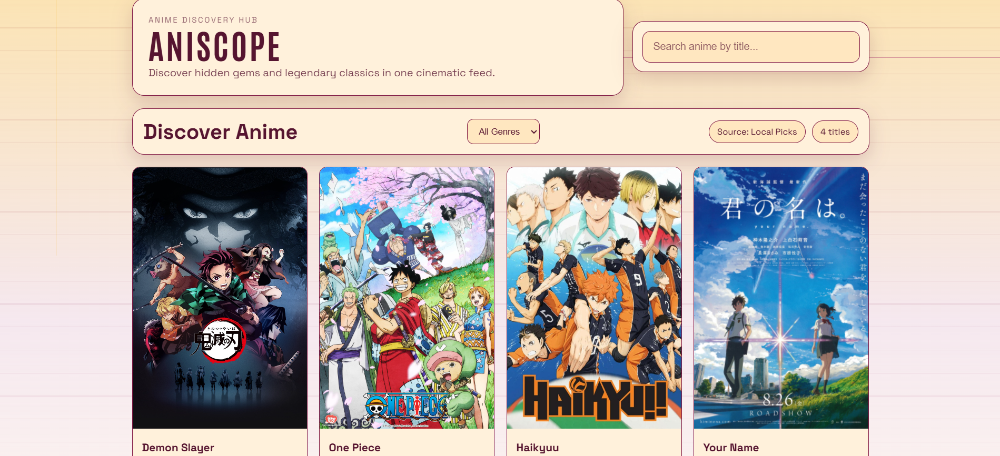
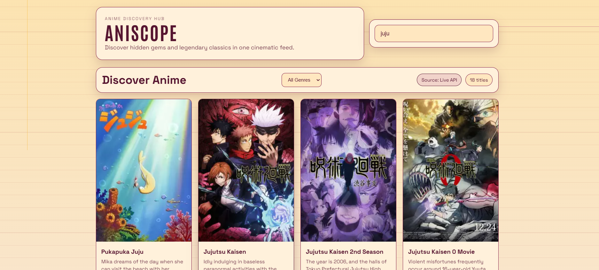
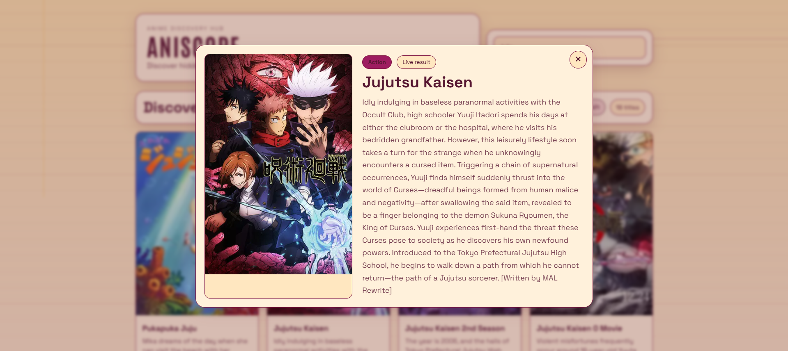
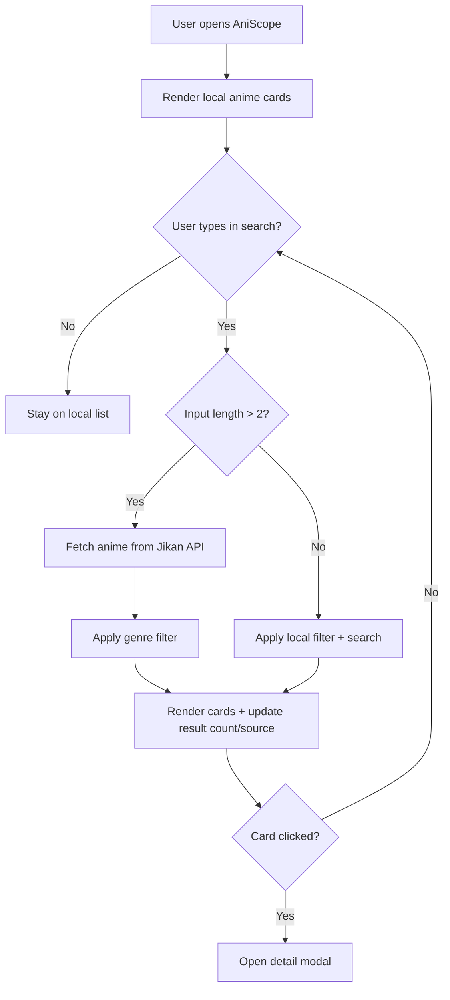
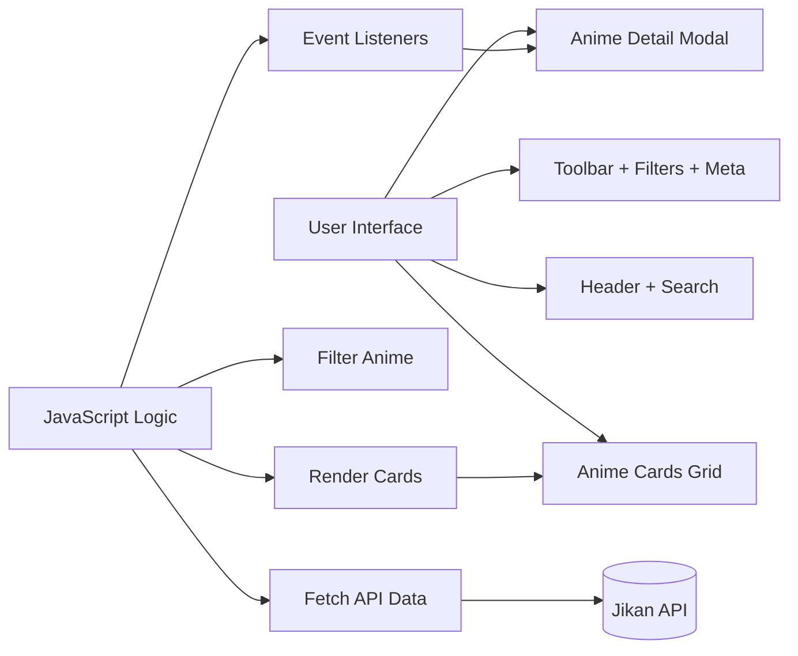

# AniScope 🎌

> A minimal anime discovery web app with an editor-inspired UI, built with HTML, CSS, and JavaScript.

AniScope helps users discover anime through a clean card interface, smart search, genre filters, smooth scroll reveals, and a polished detail modal.

## 🌐 Live Demo

🔗 Deployed App: https://ani-scope-nine.vercel.app/
## ✨ Highlights


| Feature | Description | User Benefit |
|---|---|---|
| 🔎 Smart Search | Title-based search with API fallback for longer queries | Fast anime discovery |
| 🎭 Genre Filter | Filter local and API results by selected genre | Cleaner browsing |
| 🧩 Minimal Editor UI | Clean panel layout with consistent spacing and low-noise visuals | Better focus while browsing |
| 🎨 Custom Palette | Warm brand palette with matching shades for surfaces and accents | Cohesive visual identity |
| 🍎 Smooth Scroll Motion | Apple-style reveal-on-scroll animations with staggered timing | Premium interaction feel |
| 🖼️ Detail Modal | Enhanced anime popup with source/genre chips | Better readability |
| 📊 Live Meta | Shows result count and source (Local/API) | Better context |

## 📸 Screenshots

| View | File |
|---|---|
| Home Screen | `images/home-screen.png` |
| Search Results | `images/search-results.png` |
| Anime Detail Modal | `images/detail-modal.png` |

### Home Screen



### Search Results



### Anime Detail Modal



## 🧱 Tech Stack

| Layer | Tools |
|---|---|
| Structure | HTML5 |
| Styling | CSS3 (custom properties, minimal editor-style layout, responsive design) |
| Logic | Vanilla JavaScript (DOM APIs, fetch API, event delegation) |
| Data Source | Jikan API (`https://api.jikan.moe/v4/anime`) |

## 🗂️ Project Structure

```text
AniScope/
|- images/
|  |- home-screen.png
|  |- search-results.png
|  |- detail-modal.png
|- index.html
|- style.css
|- script.js
|- README.md
```

## 🚀 Quick Start

| Step | Command / Action |
|---|---|
| 1 | `git clone https://github.com/your-username/AniScope.git` |
| 2 | `cd AniScope` |
| 3 | Open `index.html` directly OR run with VS Code Live Server |

### Option A: Run directly

1. Open `index.html` in your browser.

### Option B: Run with VS Code Live Server (recommended)

1. Open project in VS Code.
2. Install the Live Server extension.
3. Right-click `index.html` → **Open with Live Server**.

## 🔄 App Flowchart



## 🏗️ UI Architecture



## ⚙️ Configuration Guide

| What to Customize | Where | How |
|---|---|---|
| 🎨 Theme colors | `style.css` (`:root`) | Update CSS variables |
| 🌊 Scroll reveal behavior | `script.js` (`setupRevealAnimations`, `activateCardReveals`) | Tune threshold, delay, and reveal distance |
| 🧩 Default anime list | `script.js` (`animeList`) | Add/remove objects |
| 🏷️ Branding text | `index.html` | Edit title, subtitle, labels |
| 🧠 Modal content | `script.js` (`openModal`) | Add extra fields/chips |

## 🛣️ Roadmap

| Priority | Improvement |
|---|---|
| High | Debounced search to reduce API calls |
| High | Pagination or infinite scroll |
| Medium | Sorting (score, popularity, release year) |
| Medium | Theme switcher (dark/light variants) |
| Medium | Extra modal metadata (score, episodes, year) |

## 🤝 Contributing

Contributions are welcome.

1. Fork the repository
2. Create a feature branch
3. Commit your changes
4. Open a pull request

For major changes, please open an issue first to discuss your idea.

## 📜 License

This project is available under the MIT License.

---
